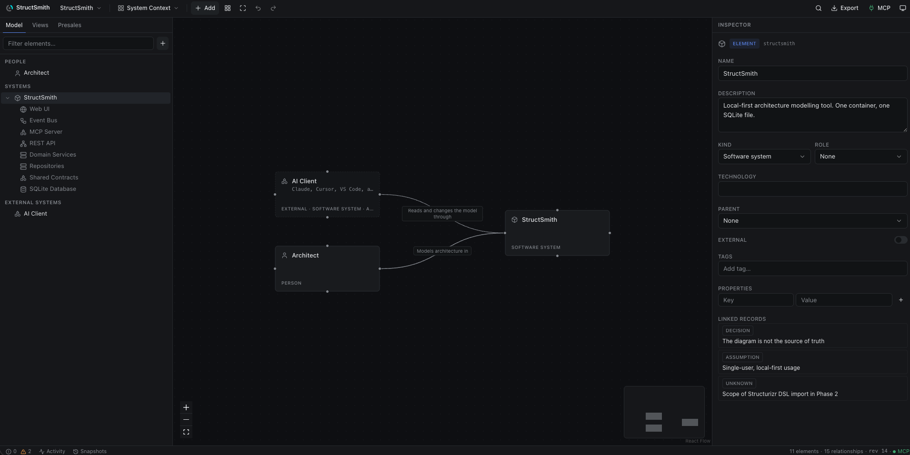
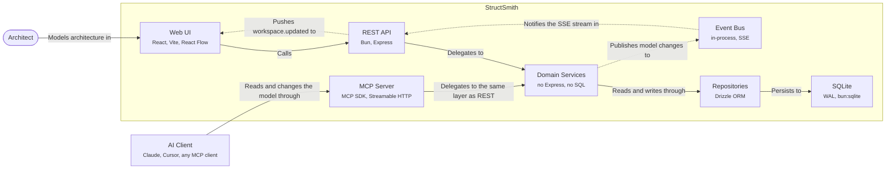

<p align="center">
  
</p>

<h1 align="center">StructSmith</h1>

<p align="center">
  Model, document and share software architecture — locally, and with your AI client.
</p>

<p align="center">
  <a href="https://github.com/dziksu/structsmith/actions/workflows/ci.yml"></a>
  <a href="LICENSE"></a>
  <a href="https://modelcontextprotocol.io"></a>
  
</p>

<p align="center">
  
</p>

A local-first, open-source tool for modelling software architecture — a self-hosted
alternative to Structurizr with a modern React Flow editor and **MCP built in**, so your
AI client works on exactly the same model you do.

> The diagram is **not** the source of truth. The semantic architecture model is.
> React Flow only visualises and lays out that model.

Useful for software architecture, the C4 model, presales, solution architecture,
architecture workshops, documenting systems, designing integrations — and for working on
architecture together with an AI assistant.

- MIT licensed, no account, no cloud, no telemetry — it works fully offline
- One container, one SQLite file
- REST API, MCP and the UI all sit on the same domain layer

---

## Quick start

### Docker Compose

```bash
docker compose up -d --build
```

Then open <http://localhost:8090>.

### Docker run

```bash
docker run -p 8090:8080 -v structsmith-data:/data ghcr.io/dziksu/structsmith:latest
```

### Local development

```bash
git clone <repository-url>
cd structsmith
bun install
bun run dev
```

`bun run dev` starts both processes: the Bun/Express API on `:3000` and the Vite dev server
on <http://localhost:5173>, which proxies `/api` and `/mcp` to the backend. The SQLite
database is created and migrated automatically — no Docker, Postgres, Redis, Java or Python
required for development.

---

## Endpoints

| URL | Purpose |
| --- | --- |
| `http://localhost:8090/` | Web UI |
| `http://localhost:8090/api/...` | REST API |
| `http://localhost:8090/mcp` | MCP (Streamable HTTP) |
| `http://localhost:8090/health` | Health check |

In development the same endpoints live on `http://localhost:3000` (and `:5173` for the UI).

---

## Connecting an AI client (MCP)

MCP is a core feature, not an add-on: it starts with the backend and is served from the same
process. The transport is **Streamable HTTP** (the deprecated SSE transport is not
implemented).

Point any MCP client at the endpoint:

```json
{
  "mcpServers": {
    "structsmith": {
      "type": "http",
      "url": "http://localhost:8090/mcp"
    }
  }
}
```

Claude Code, for example:

```bash
claude mcp add --transport http structsmith http://localhost:8090/mcp
```

For clients that only speak stdio:

```bash
bun run mcp:stdio
```

The UI shows the live endpoint, the tool list and the read-only state under **MCP** in the
top bar.

### What the AI can do

Tools cover workspaces, the model, elements, relationships, views, presales records,
snapshots and export. The preferred way to make a larger change is a single call to
`model_apply_operations`, which is atomic, revision-guarded and takes an automatic snapshot
first:

```jsonc
{
  "workspaceId": "example-client-portal",
  "label": "Add asynchronous invoice processing",
  "operations": [
    { "op": "createElement", "ref": "queue",
      "data": { "kind": "container", "role": "queue", "name": "Invoice Queue", "technology": "SQS" } },
    { "op": "createElement", "ref": "worker",
      "data": { "kind": "container", "role": "worker", "name": "Invoice Worker" } },
    { "op": "createRelationship",
      "data": { "sourceElementId": "backend-api", "targetElementId": "@queue",
                "description": "Publishes invoice jobs to", "interactionStyle": "async" } },
    { "op": "createRelationship",
      "data": { "sourceElementId": "@queue", "targetElementId": "@worker",
                "description": "Delivers jobs to", "interactionStyle": "async" } },
    { "op": "setViewElements", "viewId": "containers-view-id", "elementIds": ["@queue", "@worker"] },
    { "op": "autoLayoutView", "viewId": "containers-view-id", "direction": "LR" }
  ]
}
```

`ref` gives a new entity a local alias; later operations reference it as `@alias`. The whole
batch runs in one SQLite transaction — it either lands completely or not at all.

Resources expose the model in an AI-friendly shape (no React internals, no CSS, no viewport
data):

```
architecture://workspaces
architecture://workspace/{workspaceId}
architecture://workspace/{workspaceId}/model
architecture://workspace/{workspaceId}/views
architecture://workspace/{workspaceId}/view/{viewId}
architecture://workspace/{workspaceId}/records
```

Prompt templates: `review_architecture`, `create_presales_architecture`,
`identify_architecture_risks`, `identify_unknowns`, `review_security`, `review_scalability`.

When an AI changes the model, the browser is notified over SSE (`GET /api/events`) and the
diagram updates on its own — no refresh needed.

---

## The model

```
Workspace
 ├── Elements          person · softwareSystem · container · component ·
 │                     deploymentNode · infrastructureNode · custom
 ├── Relationships     sync · async · event · data · dependency · custom
 ├── Views             landscape · systemContext · container · component ·
 │                     deployment · custom
 ├── Records           assumption · risk · unknown · requirement · decision · note
 └── Snapshots
```

StructSmith models itself — this diagram is the container view of the example
self-model, exported straight from the tool with `export_mermaid`:



Three rules the implementation is built around:

1. **Positions belong to views, not to elements.** One element can appear on five diagrams
   without five copies of the data; moving a node never changes the architecture.
2. **Roles are not C4 levels.** `kind = container`, `role = database`,
   `technology = PostgreSQL` — roles drive icons, styling and filtering only.
3. **Views show implied relationships.** If a view shows a system but not its containers,
   traffic to those containers is lifted to the system, the way Structurizr does it.

Every workspace has a `revision`. Mutating REST and MCP calls may pass `expectedRevision`;
a mismatch returns `409 Conflict`, so a user and an AI editing at the same time cannot
silently overwrite each other.

---

## REST API

```
GET    /api/workspaces                      POST   /api/workspaces
GET    /api/workspaces/:id                  PATCH  /api/workspaces/:id
DELETE /api/workspaces/:id                  POST   /api/workspaces/import

GET    /api/workspaces/:id/model            GET    /api/workspaces/:id/document
GET    /api/workspaces/:id/validate         GET    /api/workspaces/:id/activity
GET    /api/workspaces/:id/export/mermaid
POST   /api/workspaces/:id/commands         # atomic batch of operations

POST   /api/workspaces/:id/elements         PATCH/DELETE /api/elements/:id
POST   /api/workspaces/:id/relationships    PATCH/DELETE /api/relationships/:id
GET/POST /api/workspaces/:id/views          GET/PATCH/DELETE /api/views/:id
PATCH  /api/views/:id/layout                # batched, debounced layout write
POST   /api/views/:id/elements              POST /api/views/:id/auto-layout
GET/POST /api/workspaces/:id/records        PATCH/DELETE /api/records/:id
GET/POST /api/workspaces/:id/snapshots      POST /api/snapshots/:id/restore

GET    /api/events                          # SSE: workspace.updated
GET    /api/mcp-info                        GET  /api/presets   GET /api/settings
```

Errors always use the same envelope:

```json
{ "error": { "code": "WORKSPACE_NOT_FOUND", "message": "...", "details": {} } }
```

---

## Editor

- Desktop-first three-pane layout: explorer, canvas, inspector — all resizable
- Custom React Flow nodes with icon, name, technology and a kind/role badge; external
  elements are visually distinct
- Boundaries drawn around a parent whose children are on the view
- Manual layout (debounced batch save) and automatic layout with dagre (`LR` / `TB`)
- Views: the same element on many diagrams, each with its own layout
- Presales records linked to elements, with a subtle risk indicator on the canvas
- Deterministic validator with error / warning / info levels
- Export: semantic JSON, Mermaid, PNG, SVG. Import: native JSON
- Snapshots with restore; undo/redo (`⌘Z` / `⌘⇧Z`) rides on them
- Command palette (`⌘K`), `F` to fit the view, `Delete`, `Escape`
- Light / dark / system themes, English and Polish UI

### Adding a language

The UI is fully translated through i18next. Drop a JSON file next to
`apps/web/src/i18n/locales/en.json`, register it in `apps/web/src/i18n/index.ts` and add it
to `supportedLanguages`. No copy is hard-coded in components.

---

## Configuration

| Variable | Default | Meaning |
| --- | --- | --- |
| `PORT` | `3000` (`8080` in Docker) | HTTP port |
| `HOST` | `0.0.0.0` | Bind address |
| `DATABASE_PATH` | `./data/architecture.db` | SQLite file |
| `MIGRATIONS_DIR` | `./migrations` | Migration folder |
| `AUTH_MODE` | `none` | `none` or `token` |
| `APP_TOKEN` | – | Bearer token required when `AUTH_MODE=token` |
| `MCP_READ_ONLY` | `false` | When `true`, MCP exposes no mutating tools |
| `SEED_EXAMPLE` | `true` | Seed the example workspace on first boot |
| `APP_NAME` | `StructSmith` | Product name shown in the UI |

In token mode, `/api` and `/mcp` require `Authorization: Bearer <APP_TOKEN>`; `/health`
stays public. There is no user system — this is a local/self-hosted tool.

> [!WARNING]
> The defaults (`AUTH_MODE=none`, `HOST=0.0.0.0`) are meant for `localhost`. As shipped,
> anyone who can reach the port can read **and modify** every workspace. Before exposing
> StructSmith beyond your own machine, set `AUTH_MODE=token`, put TLS in front of it, and
> publish the container port as `127.0.0.1:8090:8080`. See [SECURITY.md](SECURITY.md).

---

## Project layout

```
apps/
  web/        React + Vite UI          (React Flow, TanStack Router/Query, Zustand, shadcn-style UI)
  server/     Bun + Express            (REST, MCP transport, SSE, static UI)
packages/
  contracts/  Zod schemas and DTOs shared by frontend, backend and MCP
  domain/     Pure domain: rules, validation, operations, services (no Express, no SQLite)
  database/   Drizzle + bun:sqlite repositories implementing the domain ports
  mcp/        MCP server: tools, resources, prompts, Streamable HTTP handler
migrations/   Plain SQL, applied in order at startup
tests/        bun:test suite over the real domain and a real (in-memory) database
```

REST and MCP call the same services; only the `database` package knows SQL:

```
        REST ──┐
               ├──► Application / Domain services ──► Repositories ──► SQLite
        MCP ───┘
```

## Scripts

```bash
bun run dev         # API + UI, one command
bun run build       # production build of the UI
bun run start       # run the server with the built UI
bun run test        # domain + persistence tests
bun run typecheck   # strict TypeScript across the whole monorepo
bun run db:generate # generate a migration with drizzle-kit
bun run db:migrate  # apply migrations
bun run db:seed     # (re)create the example workspace
bun run mcp:stdio   # MCP over stdio
```

## Roadmap

Not in this MVP, but the model is designed for it: Structurizr DSL import/export,
architecture diff between snapshots, AI change preview before apply, optional vendor icon
packs, and importers for OpenAPI / Terraform / Kubernetes.

## Contributing

Pull requests are welcome. [CONTRIBUTING.md](CONTRIBUTING.md) covers the local setup, the
four commands CI runs, and the five architecture invariants a change has to respect.
Participation is governed by the [Code of Conduct](CODE_OF_CONDUCT.md), and security
issues go through [SECURITY.md](SECURITY.md) rather than public issues.

## License

MIT — see [LICENSE](LICENSE). React Flow is used strictly within its open-source scope; the
attribution is intentionally left in place.
